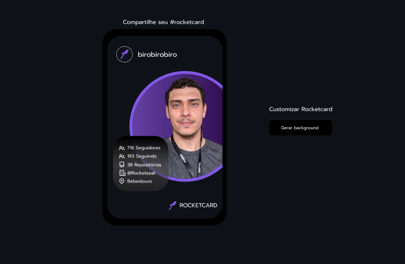
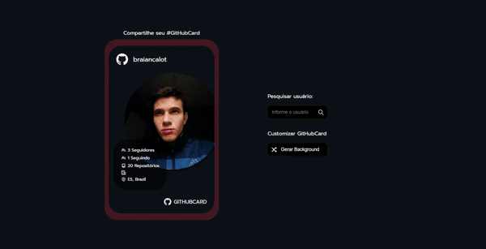

# RocketCard

## 🎯 Desafio:

Neste desafio, foi proposto a criação de uma página que contenha um card com informações da API do GitHub.
 
### Layout disponibilizado:

 

## 🚀 Resultado: 

<a href="https://github-card-seven-sigma.vercel.app">Clique aqui para acessar o projeto</a> 

## ⚒️ Tecnologias utilizadas:
* JavaScript
* HTML
* CSS
